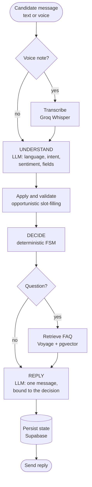
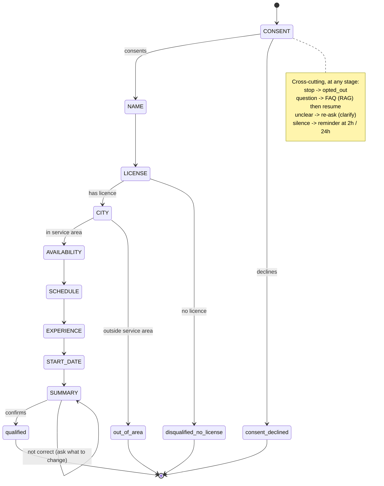
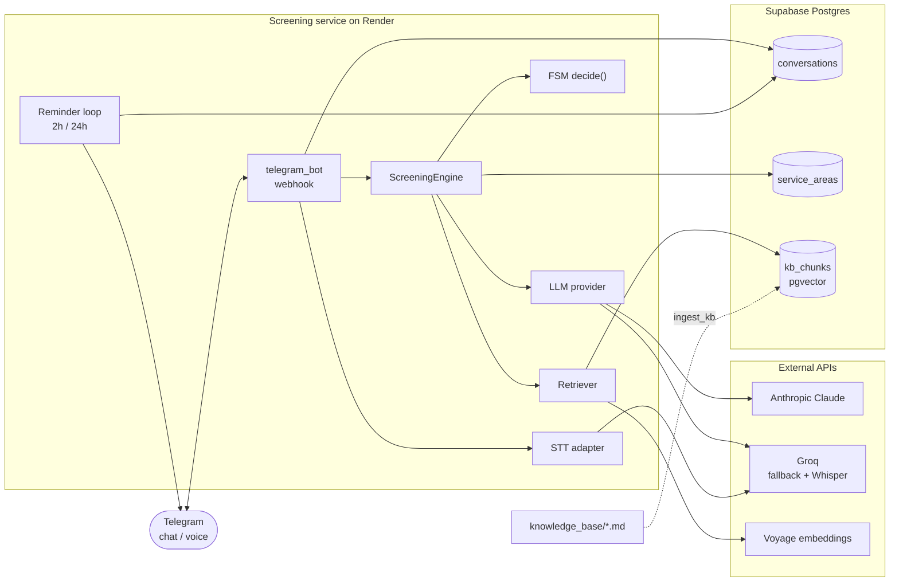

# Candidate Screening Agent — Grupo Sazón

A conversational agent that screens **delivery-driver** candidates over messaging
(Telegram), collects and validates the required data, disqualifies unfit
candidates within the first few turns, and hands the qualified ones to a human
recruiter with a structured summary.

Forward Deployed Engineer technical assignment for **Orbio AI**. Fictional
client: **Grupo Sazón**, a restaurant chain hiring delivery drivers across 45
cities in Spain and Mexico.

## The problem

Grupo Sazón receives ~200 applications per week. **60% never answer** the
screening phone calls, and recruiters spend **80% of their time** on unqualified
candidates. The two pains are a *channel* problem and a *filtering* problem, so a
win is measured on four metrics — not on "having AI":

1. **Response / completion rate** — do candidates reply and finish the screening?
2. **Recruiter time saved** — does only qualified, context-rich work reach them?
3. **Qualified-candidate throughput** — does it scale 200 → 10k/week?
4. **Candidate experience** — a respectful rejection is a future brand customer.

The design attacks the root cause: screen over **asynchronous messaging** (the
candidate answers when they can, including by voice note), filter
deterministically, and leave the recruiter only valid candidates.

## How it works

Each turn is **two LLM calls with a deterministic controller in between**:



The LLM only understands language and writes prose; **what to do next is decided
by plain Python**, not the model. This guarantees all seven fields are collected,
makes the outcome auditable, and means you cannot "talk" the agent into skipping a
gate.

### Screening flow



**Hard gates (licence and city) come early**: a candidate who cannot qualify is
closed in under four turns instead of being walked through the full
questionnaire. That is the biggest lever on the "80% of recruiter time on
unqualified candidates" pain.

**Not a form.** The controller tracks *what is still missing*, not a fixed script.
A single message can fill several fields at once ("I'm Laura, I have a licence and
I live in Madrid") and the FSM **skips** the stages already covered — that
opportunistic slot-filling is the difference between a conversation and an
interrogation.

## Features

- **Messaging-first**: one question per turn, short messages, asynchronous.
- **Bilingual ES/EN** with Spain/Mexico variants; language detected **per message**
  (handles mid-conversation switches and code-switching).
- **Voice notes**: the candidate replies with audio → transcription (Whisper) →
  the same screening graph, no pipeline change.
- **FAQ over RAG**: when the candidate asks a question ("how much does it pay?",
  "do I need a licence?") the answer is grounded in a vectorised knowledge base
  (Voyage embeddings + Supabase `pgvector`), then the pending stage resumes.
- **Re-engagement**: after 2h and 24h of silence, a reminder that resumes the
  conversation exactly where it stopped — directly targeting the 60% no-response.
- **NPS**: at the end it asks for a 0–10 rating and buckets it
  (detractor / passive / promoter) for HR.
- **Recruiter handoff**: a deterministic structured summary (no LLM cost).
- **Real persistence** in Supabase (Postgres): remembers each candidate, resumes
  after restarts; rows are readable in the Table Editor as a lightweight dashboard.
- **Model routing + fallback**: extraction on a cheap/fast model (Haiku), replies
  on a stronger one (Sonnet), with an escalation hook for emotionally-loaded turns;
  if Anthropic fails, it falls back to Groq automatically.
- **GDPR**: explicit consent up front; only what the screening needs is collected.

## Architecture & design decisions



- **Deterministic FSM + generative surface.** The controller (`orchestrator/decision.py`)
  is plain, testable Python with no LLM on the control path. The LLM is confined to
  two roles: a *verifier* (`understand`, structured output) and an *asker*
  (`reply`, bound to the decision). This is what holds reliability together and
  makes every outcome reproducible.
- **Pydantic as the single source of truth** for both validation and the LLM's
  structured output — one schema, no drift between "what we ask the model for" and
  "what we validate".
- **Two calls per turn, by design.** Splitting *understand* (cheap model,
  temperature 0 for deterministic extraction) from *reply* (stronger model, low
  temperature for a consistent voice) lets each call use the right model and keeps
  extraction stable.
- **Provider-agnostic adapter.** `agents/provider.py` wraps Anthropic (primary)
  and Groq (fallback) behind one interface, so a client who mandates their own
  provider — or a future cheaper model — is a config change, not a rewrite.
- **One store for everything.** Supabase holds conversations/state, the
  HR-editable service-area table, *and* the RAG vectors. SQLite is the
  zero-config fallback for tests.
- **Error asymmetry favours humans.** In a tight driver market a false reject
  (losing a viable candidate) costs more than a false pass, so the "out of area"
  gate offers a waitlist rather than a hard dead-end, and ambiguity should escalate
  to a human rather than auto-reject.

### Model routing & cost

Prices per 1M tokens (Claude): Haiku 4.5 `$1 / $5`, Sonnet 4.6 `$3 / $15`,
Opus 4.8 `$5 / $25`. The routing principle is to **measure the economics per task**
rather than pick one model by gut:

| Task | Frequency | Model | Why |
|---|---|---|---|
| Understand (extract fields/intent/sentiment) | every turn | Haiku 4.5 | cheap, fast, structured output |
| Reply (write the message) | every turn | Sonnet 4.6 | conversational quality; escalation hook can route harder turns up |
| End-of-conversation summary / handoff | once | deterministic | built without an LLM call at all |

The instruction/persona/FAQ prefix is identical across turns, so **prompt caching**
makes it nearly free after the first turn (cache reads ≈ 0.1× input). With
gates-first ordering, an early disqualification costs ~$0.01 versus a few cents for
a full screening.

**Indicative cost** (design estimate, to be replaced with measured `usage`):
on the order of **$0.04–0.05 per completed screening** → roughly **~$40/month** at
Grupo Sazón's current ~200/week, scaling to **~$1,950/month** at 10k/week. At that
scale the entire LLM bill is a fraction of the recruiter time it offloads — **cost
is not the bottleneck; quality and throughput are.**

### Channel & voice trade-offs

- **Messaging is the default channel** because it is both the cheapest and the
  highest-completion option, and it removes the synchronous "pick up the phone"
  friction that causes the 60% no-response. This build uses **Telegram** (instant,
  free, real mobile app, no business verification); production would map to
  WhatsApp via the Meta Cloud API (free inside the 24h customer-service window;
  only out-of-window utility templates are paid).
- **Voice notes (async) ≠ a real-time voice agent.** Async voice notes —
  transcribe the audio and feed it into the graph as text — are robust, cheap, and
  ideal for drivers on the move, so they are in the MVP (via Groq Whisper). A
  full-duplex real-time voice agent costs roughly **10× a chat screening
  (~$0.50 vs ~$0.045/min-based)** and reintroduces phone-call friction, so it is
  deliberately left as design/showcase.

## Tech stack

| Layer | Technology |
|---|---|
| Language | Python 3.11+ |
| Channel | Telegram (`python-telegram-bot`, webhook or long-polling) |
| LLM | Anthropic Claude (primary) · Groq (automatic fallback) |
| Voice (STT) | Groq Whisper (`whisper-large-v3-turbo`) |
| RAG | Voyage embeddings (`voyage-3.5-lite`) + Supabase `pgvector` |
| Data | Supabase (Postgres) via SQLAlchemy · SQLite in tests |
| Validation / schemas | Pydantic (single source for validation and structured output) |

## Project structure

```
src/
  fsm/            enums, flow (stage order), models (Pydantic)
  agents/         provider (Anthropic + Groq), prompts, schemas, stt, retrieval (RAG)
  orchestrator/   decision (the FSM `decide()`), engine, validation, handoff
  data/           service_areas (45 cities, fuzzy-match, HR-editable in Supabase)
  storage/        db, models (rows), repository
  config.py       settings (environment variables)
  main.py         CLI (for testing the flow)
  telegram_bot.py production entrypoint (the bot)
scripts/
  ingest_kb.py    ingest the knowledge base into pgvector
knowledge_base/   12 source documents for the RAG FAQ
tests/            32 deterministic tests (no network, FakeProvider double)
```

## Getting started

Requires Python 3.11+.

```bash
python -m venv .venv && source .venv/bin/activate   # Windows: .venv\Scripts\activate
pip install -e ".[dev]"
```

Environment variables (a `.env` file in the project root):

| Variable | Required | Purpose |
|---|---|---|
| `TELEGRAM_BOT_TOKEN` | yes (bot) | token from @BotFather |
| `ANTHROPIC_API_KEY` | yes | primary LLM |
| `GROQ_API_KEY` | recommended | LLM fallback **and** voice transcription |
| `DATABASE_URL` | yes (prod) | Supabase Postgres; without it, local SQLite |
| `VOYAGE_API_KEY` | optional | enables the FAQ RAG (without it, RAG degrades off gracefully) |
| `TELEGRAM_WEBHOOK_URL` | prod only | if set, runs in webhook mode; otherwise local long-polling |
| `PORT` | webhook only | server port (default 8000) |

Run:

```bash
python -m src.telegram_bot     # the bot (production / local polling)
python -m src.main             # console CLI, to walk the flow
pytest                         # tests
```

### Knowledge base (RAG)

The FAQ documents live in `knowledge_base/*.md`. To chunk, embed and upsert them
into Supabase (idempotent — only changed chunks are re-embedded):

```bash
python -m scripts.ingest_kb
```

Requires `VOYAGE_API_KEY` and `DATABASE_URL` pointing at a Supabase project with
the `pgvector` extension, the `kb_chunks` table, and the `match_kb_chunks`
function created.

## Deployment

- **Bot**: Render (Web Service) in webhook mode. With `TELEGRAM_WEBHOOK_URL` set,
  Telegram's `POST` wakes the instance (no keep-alive pinger needed).
- **Data + RAG**: a single Supabase project stores conversations, service areas and
  the FAQ vectors.
- The `service_areas` table auto-creates and seeds on startup; HR can add or
  deactivate cities from the Table Editor and changes apply within ~5 minutes.

## Limitations & future work

Built and working: the full chat screening (7 fields, gates, all outcomes),
opportunistic slot-filling, bilingual ES/EN+MX, voice notes, FAQ RAG,
re-engagement, NPS, recruiter handoff, Supabase persistence, model routing +
Groq fallback.

Designed but **not yet implemented** (honest scope cuts):

- **Low-confidence voice confirmation** — field-recorded audio (street noise,
  accents) is hard, so a "I understood *Toledo* — correct?" confirmation loop is
  important; `whisper-large-v3-turbo` doesn't expose a confidence score directly,
  so it isn't wired yet.
- **Auto-`abandoned` after the 2nd reminder** — a ghosting candidate currently
  stays `in_progress`; the final transition to `abandoned` isn't automated.
- **Attempt counter → human escalation** — after N failed clarifications on one
  field the agent should hand off to a human instead of re-asking.
- **Eval-persona harness** — there are 32 scenario tests, but not the
  persona-based eval suite (the "ghost", the "licence dodger", the
  "code-switcher", the "out-of-area") against the live LLM.
- **Funnel analytics** — beyond per-outcome rows and NPS there is no funnel /
  drop-off dashboard yet; `last_completed_stage` for abandonment analytics isn't
  surfaced.
- **Reminders on a sleeping host** — the 2h/24h nudges run in an in-process loop;
  on a free tier that sleeps the instance on idle they won't fire reliably (an
  external scheduler would fix this).
- **Design-only** (deliberately not built for the assignment): real-time
  full-duplex voice agent, WhatsApp/Twilio production channel, TOON token
  encoding, ATS integration, candidate identity/deduplication.

The cost figures above are estimates over stated assumptions; a real deployment
would instrument actual token `usage` (cache hits, tokens/turn) and replace them
with measured numbers.
